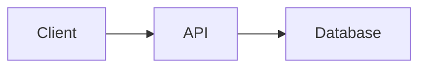

# Документация проекта

Добро пожаловать в документацию NewsAggregator!

## Навигация

Начните с [DOCUMENTATION_INDEX.md](./DOCUMENTATION_INDEX.md) — полный индекс всей документации с рекомендуемыми путями обучения для разных ролей.

## Быстрый старт

### Новый разработчик
1. [ONBOARDING.md](./ONBOARDING.md) — пошаговый гайд (1 час)
2. [ARCHITECTURE.md](./ARCHITECTURE.md) — архитектура системы (20 мин)
3. [guide/DEVELOPER_GUIDE.md](./guide/DEVELOPER_GUIDE.md) — частые задачи (25 мин)

### Конкретная задача
Используйте [DOCUMENTATION_INDEX.md](./DOCUMENTATION_INDEX.md) → раздел "Частые задачи"

## Структура документации

```
docs/
├── DOCUMENTATION_INDEX.md          # Главный индекс (начните здесь)
├── ROADMAP.md                      # Планы развития проекта
├── ARCHITECTURE.md                 # Архитектура системы
├── DATABASE_ARCHITECTURE.md        # Структура БД
├── ONBOARDING.md                   # Гайд для новичков
├── TESTING.md                      # Тестирование
├── TROUBLESHOOTING.md              # Решение проблем
├── AUTHENTICATION.md               # Аутентификация
│
├── diagrams/                       # Диаграммы
│   ├── DATA_FLOW.md               # Потоки данных
│   ├── C4_ARCHITECTURE.md         # C4-модель
│   ├── DATABASE_SCHEMA.md         # ER-диаграмма
│   └── MODULE_DEPENDENCIES.md     # Зависимости модулей
│
├── guide/                          # Специализированные гайды
│   ├── DEVELOPER_GUIDE.md         # Частые задачи
│   ├── YOUTUBE_GUIDE.md           # YouTube интеграция
│   ├── TELEGRAM_GUIDE.md          # Telegram интеграция
│   ├── PERSONAL_FEED_GUIDE.md     # Личные кабинеты
│   ├── WEATHER_SYSTEM_GUIDE.md    # Модуль погоды
│   ├── CLUSTERING_GUIDE.md        # Кластеризация
│   ├── NER_SERVICE_GUIDE.md       # NER-сервис
│   ├── MONITOR_GUIDE.md           # Кабинет мониторинга
│   ├── ANALYTICS_GUIDE.md         # Аналитика
│   ├── DONATE_GUIDE.md            # Система донатов
│   ├── API_KEYS_GUIDE.md          # API-ключи
│   ├── PERFORMANCE.md             # Оптимизация
│   ├── DEPLOY_GUIDE.md            # Деплой (2GB)
│   ├── DEPLOY_GUIDE_4GB.md        # Деплой (4GB)
│   └── RSSHUB_GUIDE.md            # RSSHub
│
└── adr/                            # Architecture Decision Records
    ├── README.md
    ├── 0001-event-bus-architecture.md
    ├── 0002-drizzle-orm.md
    └── ...
```

## Обновление документации

### Когда обновлять

**Обязательно:**
- ✅ Новые API эндпоинты → [guide/DEVELOPER_GUIDE.md](./guide/DEVELOPER_GUIDE.md)
- ✅ Изменение БД → [DATABASE_ARCHITECTURE.md](./DATABASE_ARCHITECTURE.md), [diagrams/DATABASE_SCHEMA.md](./diagrams/DATABASE_SCHEMA.md)
- ✅ Новая функциональность → [README.md](../README.md), [ARCHITECTURE.md](./ARCHITECTURE.md)
- ✅ Новая зависимость → [diagrams/MODULE_DEPENDENCIES.md](./diagrams/MODULE_DEPENDENCIES.md)

**Желательно:**
- Рефакторинг → [ARCHITECTURE.md](./ARCHITECTURE.md)
- Оптимизация → [guide/PERFORMANCE.md](./guide/PERFORMANCE.md)
- Исправление бага → [TROUBLESHOOTING.md](./TROUBLESHOOTING.md)

### Как обновлять

1. **Внести изменения** в соответствующий документ
2. **Обновить версию** документа (если это ключевой документ: ARCHITECTURE, DATABASE_ARCHITECTURE, DOCUMENTATION_INDEX)
3. **Обновить [DOCUMENTATION_INDEX.md](./DOCUMENTATION_INDEX.md)** если:
   - Добавлен новый документ
   - Изменена структура
   - Добавлены новые ссылки
4. **Проверить ссылки** между документами
5. **Создать PR** с меткой `docs`

### Версионирование ключевых документов

Формат версии в заголовке:

```markdown
> **Версия:** X.Y.Z  
> **Создан:** Месяц ГГГГ  
> **Последнее обновление:** Месяц ГГГГ
```

**Правила версионирования:**
- **Major (X)** — кардинальные изменения структуры/архитектуры
- **Minor (Y)** — добавление новых разделов, значительные обновления
- **Patch (Z)** — исправления, уточнения, мелкие дополнения

**Документы с версионированием:**
- [DOCUMENTATION_INDEX.md](./DOCUMENTATION_INDEX.md)
- [ARCHITECTURE.md](./ARCHITECTURE.md)
- [DATABASE_ARCHITECTURE.md](./DATABASE_ARCHITECTURE.md)

### Проверка ссылок

Автоматическая проверка битых ссылок запускается:
- При push в `main`/`develop` с изменениями в `docs/**/*.md`
- При создании PR с изменениями в документации
- Каждый понедельник в 00:00 UTC (scheduled)

Конфигурация: `.github/workflows/docs-link-check.yml`

## Стиль документации

### Markdown

- Используйте заголовки H2 (`##`) для основных разделов
- Используйте таблицы для структурированных данных
- Используйте code blocks с указанием языка
- Используйте относительные ссылки между документами

### Примеры кода

```typescript
// ✅ Хорошо: с комментариями и типами
interface NewsArticle {
  id: number;
  title: string;
  publishedAt: Date;
}

// ❌ Плохо: без контекста
const data = await fetch('/api/news');
```

### Диаграммы

Используйте Mermaid для диаграмм:



## Контакты

- **GitHub Issues:** https://github.com/Chucha-blog/blogpro/issues
- **Email:** rockbandbugs@gmail.com

---

*Последнее обновление: Май 2025*
