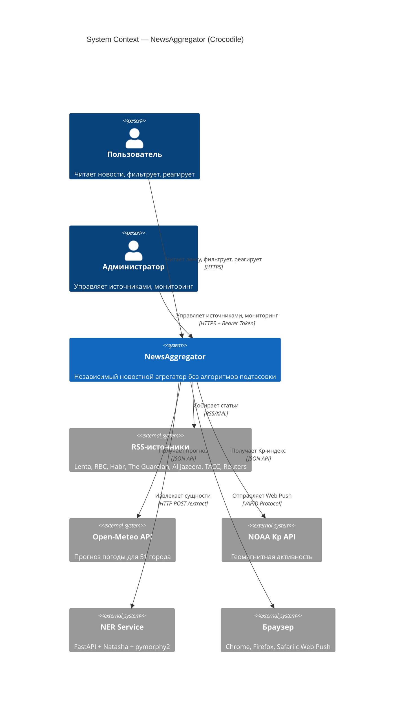
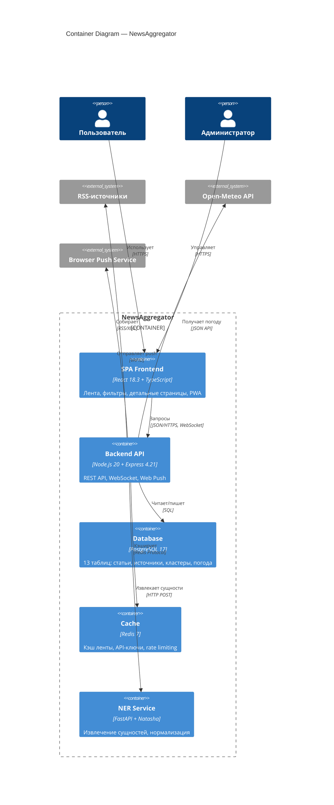
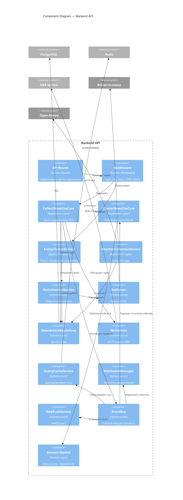
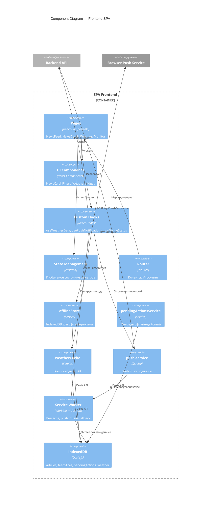
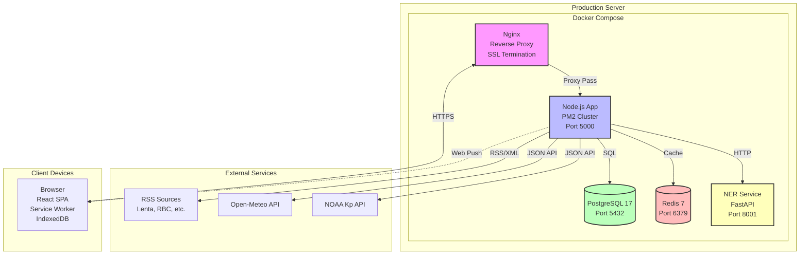

# C4 Architecture Model

> Версия: 1.0  
> Создан: Май 2025

---

## Level 1: System Context

---

## Level 2: Container Diagram

---

## Level 3: Component Diagram — Backend API

---

## Level 3: Component Diagram — Frontend SPA

---

## Deployment Diagram

---

## Data Flow Summary

### Сбор новостей (каждые 2-10 минут)
1. **node-cron** → CollectNewsUseCase
2. RssCollectionService → RssParser → RSS-источники
3. ArticleManagementService → PostgreSQL (INSERT)
4. NerService → NER Service (POST /extract)
5. EventBus → ClusterNewsUseCase → кластеризация
6. EventBus → QueryCacheService → инвалидация Redis
7. EventBus → WebSocketManager → уведомление клиентов
8. EventBus → WebPushService → push-рассылка (если >= 5 статей)

### Чтение ленты
1. Browser → GET /api/news
2. apiKeyAuth → rate limit (120 req/мин без ключа)
3. QueryCacheService → Redis (TTL 300s)
4. При промахе: NewsArticleRepository → PostgreSQL
5. Ответ → Browser + сохранение в IndexedDB

### Офлайн-режим
1. Browser → fetch перехватывается Service Worker
2. Service Worker → IndexedDB (Dexie)
3. Возврат кэшированных данных
4. Реакции → pendingActions queue
5. При возврате онлайн → синхронизация с API

### Погода (каждые 3 часа)
1. node-cron → WeatherCollectionService
2. Open-Meteo API → 7 дней + 2 дня почасовки
3. NOAA API → Kp-индекс
4. PostgreSQL → UPSERT weather_forecasts
5. Browser → GET /api/weather/week → IndexedDB (TTL 1ч)

---

## Technology Stack

### Frontend
- **React 18.3.1** — UI framework
- **TypeScript 5.6.3** — type safety
- **Vite 6.3.5** — build tool
- **Wouter** — routing
- **Zustand** — state management
- **Dexie.js** — IndexedDB wrapper
- **Workbox** — Service Worker
- **@tanstack/react-virtual** — виртуализация ленты

### Backend
- **Node.js 20** — runtime
- **Express.js 4.21.2** — web framework
- **Drizzle ORM** — database access
- **express-ws** — WebSocket
- **web-push** — VAPID push
- **node-cron** — scheduler
- **Winston** — logging

### Infrastructure
- **PostgreSQL 17** — primary database
- **Redis 7** — cache + rate limiting
- **Nginx** — reverse proxy
- **PM2** — process manager
- **Docker + Docker Compose** — containerization

### External Services
- **FastAPI** — NER service
- **Natasha** — Russian NER
- **pymorphy2** — morphological analysis
- **Open-Meteo** — weather API
- **NOAA** — geomagnetic activity

---

> См. также: [DATA_FLOW.md](./DATA_FLOW.md), [DATABASE_SCHEMA.md](./DATABASE_SCHEMA.md), [MODULE_DEPENDENCIES.md](./MODULE_DEPENDENCIES.md)
