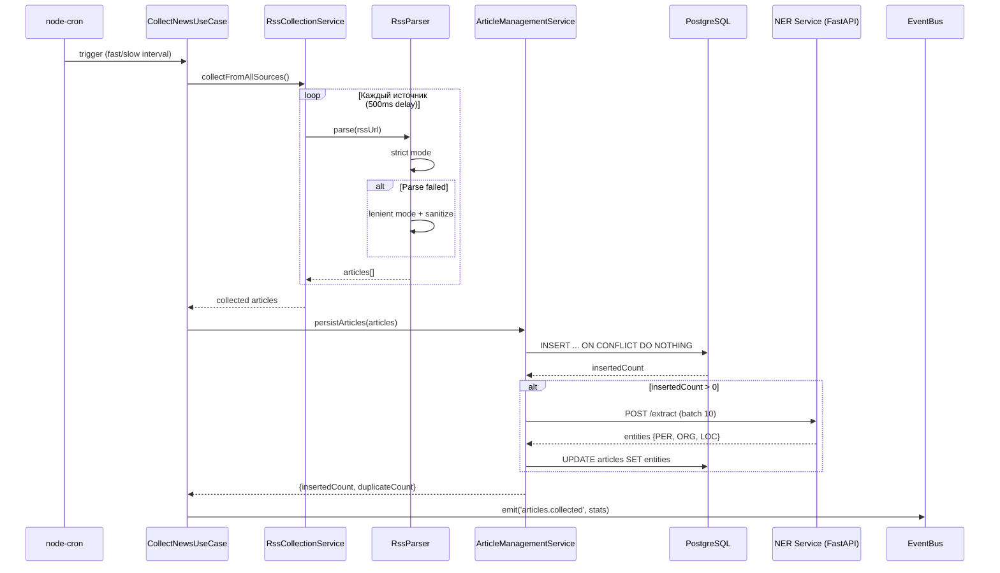
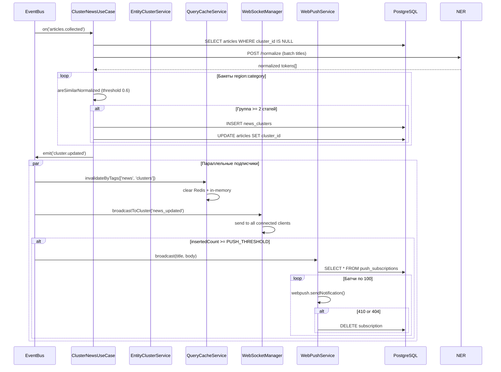
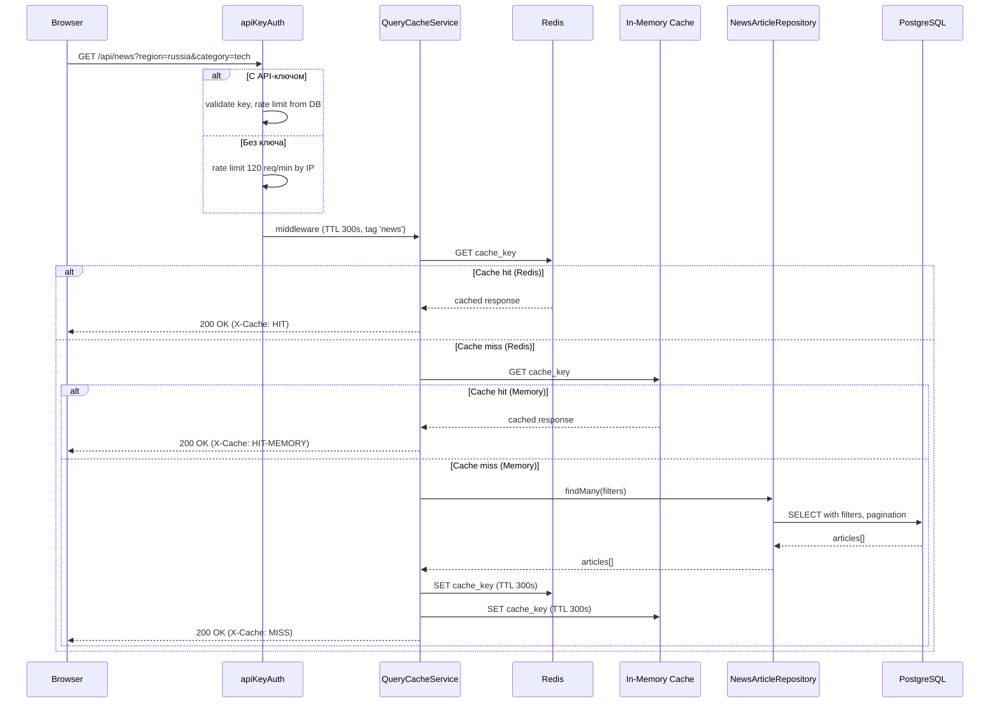
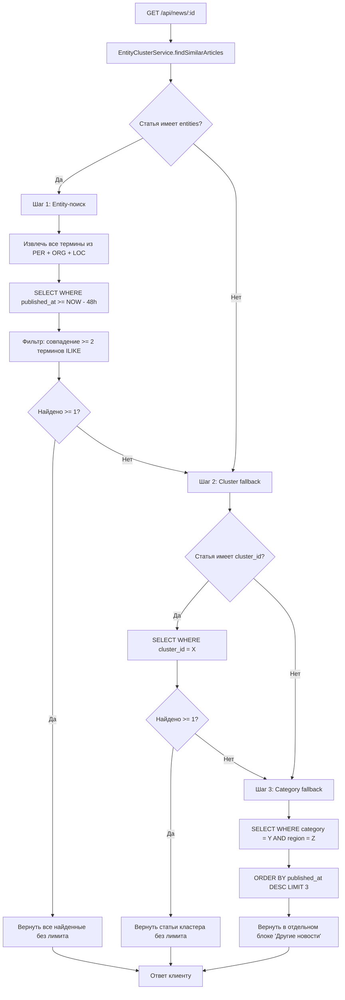
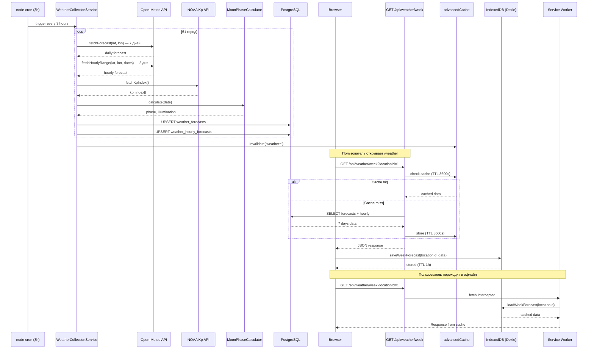
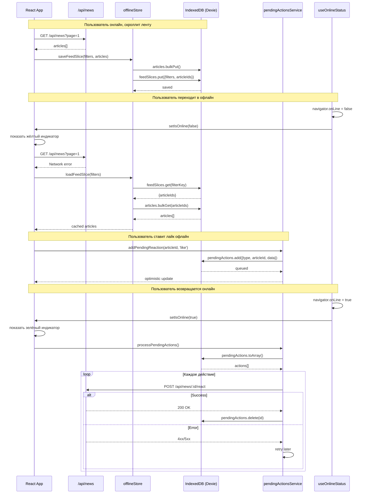

# Диаграммы потоков данных

> Версия: 1.0  
> Создан: Май 2025

---

## 1. RSS сбор → сохранение → NER → EventBus

---

## 2. EventBus → кластеризация → инвалидация кэша → уведомления

---

## 3. GET /api/news → кэш → БД → ответ

---

## 4. Детальная страница → Entity-поиск → Cluster fallback → Category fallback

---

## 5. Погода: cron → Open-Meteo → БД → API → клиент → IndexedDB

---

## 6. Web Push: подписка → рассылка → уведомление

```mermaid
sequenceDiagram
    participant Client as Browser
    participant SW as Service Worker
    participant API as POST /api/push/subscribe
    participant DB as PostgreSQL
    participant Cron as RSS Collection
    participant Push as WebPushService
    participant VAPID as Web Push Protocol

    Note over Client,SW: Пользователь разрешает уведомления
    
    Client->>SW: navigator.serviceWorker.ready
    SW->>SW: pushManager.subscribe(VAPID_PUBLIC_KEY)
    SW-->>Client: subscription {endpoint, keys}
    Client->>API: POST /api/push/subscribe
    API->>DB: INSERT push_subscriptions
    DB-->>API: success
    API-->>Client: 200 OK
    
    Note over Cron,Push: Сбор новостей завершён
    
    Cron->>Push: insertedCount >= PUSH_THRESHOLD
    Push->>DB: SELECT * FROM push_subscriptions
    DB-->>Push: subscriptions[]
    
    loop Батчи по 100
        Push->>VAPID: webpush.sendNotification(subscription, payload)
        
        alt Success
            VAPID-->>Push: 201 Created
        else 410 Gone or 404 Not Found
            VAPID-->>Push: error
            Push->>DB: DELETE subscription
        end
    end
    
    Note over Client,SW: Браузер получает push
    
    VAPID->>SW: push event
    SW->>SW: showNotification(title, body, icon)
    SW-->>Client: Notification displayed
    
    Client->>SW: notificationclick
    SW->>Client: clients.openWindow('/')
```

---

## 7. Офлайн-режим: сохранение → чтение → синхронизация

---

## Легенда

### Компоненты

- **Cron** — node-cron планировщик
- **CollectNewsUseCase** — оркестрация сбора
- **RssCollectionService** — сбор из источников
- **RssParser** — парсинг RSS (strict/lenient)
- **ArticleManagementService** — сохранение + NER
- **ClusterNewsUseCase** — кластеризация
- **EntityClusterService** — поиск похожих по сущностям
- **QueryCacheService** — двухуровневый кэш (Redis + Memory)
- **WebSocketManager** — real-time уведомления
- **WebPushService** — VAPID push-рассылка
- **NewsArticleRepository** — доступ к БД
- **apiKeyAuth** — rate limiting middleware
- **offlineStore** — IndexedDB для офлайн-режима
- **pendingActionsService** — очередь офлайн-действий

### Ключевые решения

1. **Дедупликация по URL** — `ON CONFLICT DO NOTHING` в БД
2. **Батчинг NER** — по 10 заголовков за запрос
3. **Двухуровневый кэш** — Redis → Memory fallback
4. **Тегированная инвалидация** — по событиям EventBus
5. **Entity-first поиск** — 48ч окно, минимум 2 совпадения
6. **Cluster fallback** — если entity-поиск пустой
7. **Category fallback** — 3 статьи из той же категории
8. **Push батчи** — по 100 подписок, автоудаление 410/404
9. **Офлайн GC** — TTL 14 дней, лимит 3000 статей
10. **Погода кэш** — 1 час TTL в IDB, 7 дней GC

---

> См. также: [ARCHITECTURE.md](../ARCHITECTURE.md), [CLUSTERING_GUIDE.md](../CLUSTERING_GUIDE.md), [NER_SERVICE_GUIDE.md](../NER_SERVICE_GUIDE.md)
