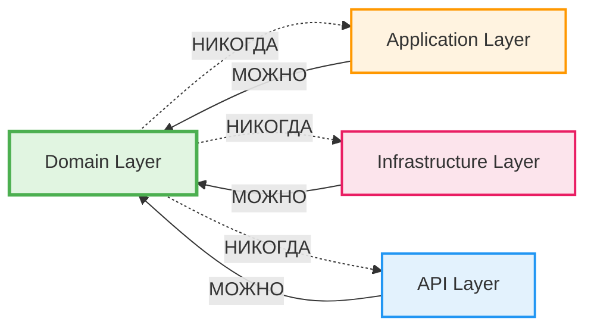
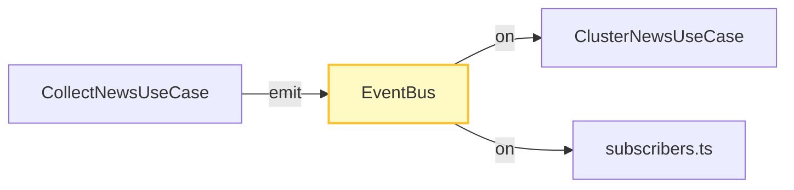
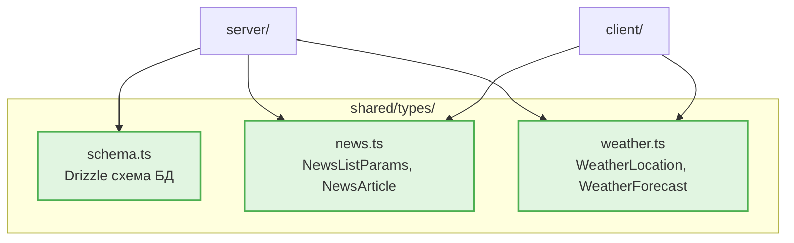
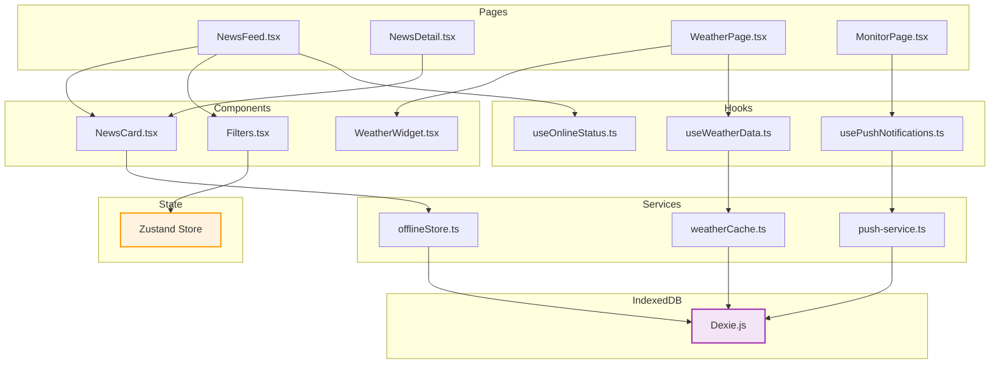
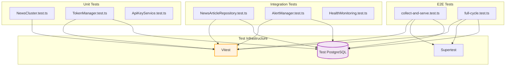

# Module Dependencies

> Версия: 1.0  
> Создан: Май 2025

---

## DDD Layers — Dependency Graph

```mermaid
graph TB
    subgraph "API Layer"
        API[api/]
        NewsAPI[api/news/]
        AdminAPI[api/admin/]
        WeatherAPI[api/weather/]
        PushAPI[api/push/]
        RSSAPI[api/rss/]
    end

    subgraph "Application Layer"
        CollectUC[CollectNewsUseCase]
        ClusterUC[ClusterNewsUseCase]
        EntityCluster[EntityClusterService]
        ArticleMgmt[ArticleManagementService]
        RssCollection[RssCollectionService]
        WeatherJob[WeatherCollectionService]
        HotEntities[HotEntitiesJob]
        Subscribers[subscribers.ts]
    end

    subgraph "Infrastructure Layer"
        Repos[Repositories]
        NER[ner/NerService]
        Cache[monitoring/QueryCacheService]
        WS[cluster/WebSocketManager]
        Push[push/WebPushService]
        Audit[audit/AuditLogger]
        Auth[auth/TokenManager + ApiKeyService]
        EventBus[events/EventBus]
        RssParser[rss/RssParser]
        Weather[weather/OpenMeteoClient]
    end

    subgraph "Domain Layer"
        Models[domain/news/]
        NewsCluster[NewsCluster.ts]
        NewsArticle[NewsArticle.ts]
    end

    subgraph "Middleware"
        MW[middleware/]
        AuthMW[authenticateAdmin]
        ApiKeyMW[apiKeyAuth]
        DDOS[ddosProtection]
    end

    subgraph "External"
        DB[(PostgreSQL)]
        Redis[(Redis)]
        NERService[NER Service<br/>FastAPI]
        RSSFeeds[RSS Sources]
        OpenMeteo[Open-Meteo API]
    end

    %% API → Application
    API --> CollectUC
    API --> EntityCluster
    API --> ArticleMgmt
    NewsAPI --> EntityCluster
    AdminAPI --> CollectUC
    AdminAPI --> WeatherJob
    WeatherAPI --> Weather
    PushAPI --> Push
    RSSAPI --> Repos

    %% API → Middleware
    API --> MW
    AdminAPI --> AuthMW
    NewsAPI --> ApiKeyMW
    API --> DDOS

    %% Application → Infrastructure
    CollectUC --> RssCollection
    CollectUC --> ArticleMgmt
    CollectUC --> EventBus
    ClusterUC --> Repos
    ClusterUC --> NER
    ClusterUC --> EventBus
    EntityCluster --> Repos
    ArticleMgmt --> Repos
    ArticleMgmt --> NER
    RssCollection --> RssParser
    WeatherJob --> Weather
    WeatherJob --> Repos
    HotEntities --> Repos
    Subscribers --> Cache
    Subscribers --> WS
    Subscribers --> Push

    %% Application → Domain
    ClusterUC --> NewsCluster
    EntityCluster --> Models

    %% Infrastructure → External
    Repos --> DB
    Cache --> Redis
    Cache --> DB
    NER --> NERService
    RssParser --> RSSFeeds
    Weather --> OpenMeteo
    Auth --> DB
    Audit --> DB
    Push --> DB

    %% Middleware → Infrastructure
    AuthMW --> Auth
    ApiKeyMW --> Auth
    DDOS --> Cache

    %% EventBus subscribers
    EventBus -.->|articles.collected| ClusterUC
    EventBus -.->|articles.collected| Subscribers
    EventBus -.->|cluster.updated| Subscribers

    style Models fill:#e1f5e1,stroke:#4caf50,stroke-width:3px
    style API fill:#e3f2fd,stroke:#2196f3,stroke-width:2px
    style CollectUC fill:#fff3e0,stroke:#ff9800,stroke-width:2px
    style Repos fill:#fce4ec,stroke:#e91e63,stroke-width:2px
    style DB fill:#f3e5f5,stroke:#9c27b0,stroke-width:2px
    style Redis fill:#ffebee,stroke:#f44336,stroke-width:2px
```



---

## Правило изоляции Domain Layer



**Domain Layer:**
- Содержит бизнес-логику и правила
- Не зависит от фреймворков, БД, HTTP
- Чистые функции и типы

**Примеры:**
- `NewsCluster.areSimilarNormalized()` — правило схожести заголовков
- `NewsCluster.tokenizeNormalized()` — токенизация с нормализацией
- `NewsArticle` — интерфейс статьи

---

## Циклические зависимости

### Отсутствуют

Архитектура спроектирована без циклов:
- Domain не импортирует никого
- Application импортирует Domain + Infrastructure
- Infrastructure импортирует Domain
- API импортирует Application + Infrastructure + Middleware

### EventBus как развязка



Без EventBus была бы прямая зависимость:
```
CollectNewsUseCase → ClusterNewsUseCase → QueryCacheService → WebSocketManager
```

С EventBus:
```
CollectNewsUseCase → EventBus
EventBus ← ClusterNewsUseCase
EventBus ← subscribers.ts → QueryCacheService, WebSocketManager
```

---

## Внешние зависимости по слоям

### Domain Layer
```json
{
  "dependencies": []
}
```

### Application Layer
```json
{
  "dependencies": [
    "domain/news/*"
  ]
}
```

### Infrastructure Layer
```json
{
  "dependencies": [
    "drizzle-orm",
    "pg",
    "redis",
    "rss-parser",
    "sanitize-html",
    "web-push",
    "winston",
    "node-cron"
  ]
}
```

### API Layer
```json
{
  "dependencies": [
    "express",
    "express-ws",
    "express-rate-limit",
    "zod",
    "cors",
    "helmet"
  ]
}
```

---

## Dependency Injection

### Ручная инъекция через конструкторы

```typescript
// Infrastructure
const newsArticleRepository = new NewsArticleRepository(db);
const nerService = new GracefulNerService(new NerService());

// Application
const articleManagementService = new ArticleManagementService(
  newsArticleRepository,
  nerService
);

const collectNewsUseCase = new CollectNewsUseCase(
  rssCollectionService,
  articleManagementService,
  eventBus
);

// API
app.post('/api/admin/jobs/rss-collect', authenticateAdmin, async (req, res) => {
  const result = await collectNewsUseCase.execute(req.body.group);
  res.json(result);
});
```

**Преимущества:**
- Явные зависимости
- Легко тестировать (mock через конструктор)
- Нет магии DI-контейнера

---

## Shared Types



**Shared типы:**
- `schema.ts` — Drizzle схема (используется сервером)
- `news.ts` — интерфейсы API (клиент + сервер)
- `weather.ts` — интерфейсы погоды (клиент + сервер)

---

## Frontend Dependencies



---

## NPM Dependencies (Top-level)

### Production

```json
{
  "express": "4.21.2",
  "drizzle-orm": "^0.36.4",
  "pg": "^8.13.1",
  "redis": "^4.7.0",
  "rss-parser": "^3.13.0",
  "sanitize-html": "^2.13.1",
  "web-push": "^3.6.7",
  "winston": "^3.17.0",
  "node-cron": "^3.0.3",
  "express-ws": "^5.0.2",
  "express-rate-limit": "^7.4.1",
  "zod": "^3.24.1",
  "bcrypt": "^5.1.1",
  "react": "18.3.1",
  "wouter": "^3.3.5",
  "zustand": "^5.0.2",
  "dexie": "^4.0.10",
  "@tanstack/react-virtual": "^3.11.1",
  "recharts": "^2.15.0",
  "qrcode.react": "^4.1.0"
}
```

### Development

```json
{
  "typescript": "5.6.3",
  "vite": "6.3.5",
  "vitest": "^2.1.8",
  "drizzle-kit": "^0.29.1",
  "eslint": "^9.17.0",
  "prettier": "^3.4.2",
  "tsx": "^4.19.2",
  "supertest": "^7.0.0",
  "happy-dom": "^16.11.6"
}
```

---

## Import Rules

### Запрещено

```typescript
// ❌ Domain импортирует Application
// domain/news/NewsCluster.ts
import { ClusterNewsUseCase } from '../../application/news/ClusterNewsUseCase';

// ❌ Domain импортирует Infrastructure
// domain/news/NewsArticle.ts
import { NewsArticleRepository } from '../../infrastructure/persistence/NewsArticleRepository';

// ❌ Application импортирует API
// application/news/CollectNewsUseCase.ts
import { newsRouter } from '../../api/news';
```

### Разрешено

```typescript
// ✅ Application импортирует Domain
// application/news/ClusterNewsUseCase.ts
import { NewsCluster } from '../../domain/news/NewsCluster';

// ✅ Application импортирует Infrastructure
// application/news/CollectNewsUseCase.ts
import { NewsArticleRepository } from '../../infrastructure/persistence/NewsArticleRepository';

// ✅ API импортирует Application
// api/news/index.ts
import { EntityClusterService } from '../../application/news/EntityClusterService';

// ✅ Infrastructure импортирует Domain
// infrastructure/persistence/NewsArticleRepository.ts
import { NewsArticle } from '../../domain/news/NewsArticle';
```

---

## Testing Dependencies



---

## Dependency Metrics

| Layer | Files | External Deps | Internal Deps |
|-------|-------|---------------|---------------|
| Domain | 5 | 0 | 0 |
| Application | 15 | 0 | Domain (5) |
| Infrastructure | 35 | 12 | Domain (5) |
| API | 20 | 8 | Application (15), Infrastructure (35) |
| Middleware | 8 | 3 | Infrastructure (5) |

**Итого:**
- 83 файла серверного кода
- 23 внешние зависимости (production)
- Нет циклических зависимостей
- Domain Layer полностью изолирован

---

> См. также: [C4_ARCHITECTURE.md](./C4_ARCHITECTURE.md), [DATA_FLOW.md](./DATA_FLOW.md), [ARCHITECTURE.md](../ARCHITECTURE.md)
